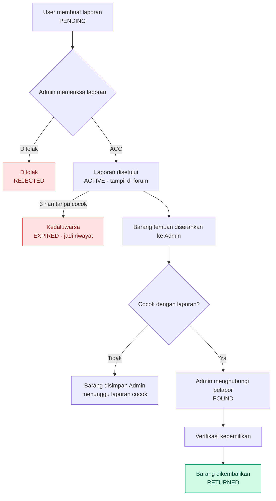

# Lost & Found Terintegrasi Kampus

> Satu tempat resmi untuk melaporkan barang hilang, dan satu pintu (Admin) untuk mengembalikannya ke pemilik.

## 1. Ringkasan dalam 1 Menit

**Lost & Found Terintegrasi Kampus** adalah aplikasi web tempat mahasiswa melaporkan barang hilang, sementara pihak kampus (Admin) memverifikasi laporan dan mengelola pengembalian barang yang ditemukan.

| Pertanyaan | Jawaban singkat |
| --- | --- |
| Untuk siapa? | Mahasiswa (User) dan pihak kampus (Admin) |
| Apa yang dilakukan User? | Membuat laporan barang hilang dan memantau statusnya |
| Bagaimana jika ada yang menemukan barang? | Penemu menyerahkan barang langsung ke Admin, tidak lewat website |
| Apa peran Admin? | Memverifikasi laporan, mencatat barang temuan, mencocokkan, memverifikasi pemilik, dan mengembalikan barang |
| Berapa lama laporan aktif? | Maksimal 3 hari sejak disetujui |
| Kenapa lebih baik dari grup WhatsApp? | Data terpusat, terverifikasi, dan punya status serta riwayat |

## 2. Masalah dan Solusi

Pengelolaan barang hilang lewat grup chat punya banyak kelemahan. Sistem ini menjawab masing-masing kelemahan tersebut.

| Masalah di grup chat | Solusi di sistem |
| --- | --- |
| Informasi tertimbun chat baru | Forum terstruktur dengan pencarian dan filter |
| Laporan lama sulit dicari | Database terpusat dan riwayat laporan |
| Format informasi tidak seragam | Form laporan baku: nama, kategori, foto, warna, merk, lokasi, tanggal, deskripsi |
| Siapa saja bisa posting tanpa verifikasi | Laporan harus di-ACC Admin sebelum tampil |
| Status laporan tidak jelas | Enam status laporan yang jelas |
| Tidak ada batas waktu | Laporan aktif otomatis `EXPIRED` setelah 3 hari |
| Admin kewalahan mengelola laporan | Dashboard Admin untuk verifikasi, pencocokan, dan pengembalian |

## 3. Aturan Utama Sistem

Enam aturan ini adalah inti rancangan dan mudah dijelaskan satu per satu.

1. **Hanya dua role:** User dan Admin.
2. **User hanya melaporkan barang hilang.** Tidak ada form barang temuan untuk User.
3. **Barang temuan diserahkan langsung ke Admin,** supaya barang pasti berada di bawah pengelolaan kampus.
4. **Setiap laporan harus di-ACC Admin** sebelum masuk forum.
5. **Laporan aktif maksimal 3 hari,** lalu berstatus `EXPIRED`. Datanya tetap tersimpan sebagai riwayat.
6. **Barang hanya diserahkan setelah Admin memverifikasi kepemilikan.**

## 4. Peran Pengguna

|  | User (Mahasiswa) | Admin (Pihak Kampus) |
| --- | --- | --- |
| Akun | Register dan login | Login |
| Laporan | Membuat laporan, melihat status dan riwayat | Melihat, menyetujui, atau menolak laporan |
| Forum | Melihat, mencari, dan memfilter laporan | Mempublikasikan laporan yang disetujui |
| Barang temuan | Menyerahkan ke Admin (di luar sistem) | Mencatat, mencocokkan, menghubungi pelapor, memverifikasi pemilik, dan mengembalikan |
| Pengelolaan | - | Mengelola data user dan riwayat laporan |

User tidak dapat mengakses halaman Admin. Hak akses dibedakan berdasarkan role.

## 5. Alur Kerja

Berikut alur dari laporan dibuat sampai barang kembali ke pemilik, atau laporan kedaluwarsa.

## Alur Sistem

### Contoh skenario: dompet hitam

1. Rina kehilangan dompet hitam merk Eiger di Fakultas Teknik pada 30 September 2026, lalu membuat laporan. Status: `PENDING`.
2. Admin memeriksa dan menyetujui laporan. Status menjadi `ACTIVE` dan laporan tampil di forum selama 3 hari.
3. Dimas menemukan dompet itu dan menyerahkannya langsung ke Admin.
4. Admin mencatat barang temuan, lalu mencari laporan yang cocok di database.
5. Laporan Rina cocok. Admin menghubungi Rina.
6. Rina datang ke Admin. Admin memverifikasi kepemilikan lewat isi dompet dan ciri khusus barang.
7. Dompet diserahkan dan status menjadi `RETURNED`.

## 6. Fitur Utama

### 6.1 Registrasi dan login

Registrasi meminta data berikut agar sistem hanya dipakai civitas kampus.

| Data | Keterangan |
| --- | --- |
| Nama Lengkap | Nama mahasiswa |
| NIM | Nomor Induk Mahasiswa, harus unik |
| Program Studi | Program studi mahasiswa |
| Password | Disimpan dalam bentuk hash |

Satu NIM hanya boleh memiliki satu akun, dan semua data wajib diisi.

### 6.2 Laporan barang hilang

| Field | Keterangan |
| --- | --- |
| Nama Barang | Nama barang yang hilang |
| Kategori | Kategori barang |
| Foto | Foto barang |
| Warna | Warna barang |
| Merk | Merk barang, jika ada |
| Tanggal Kehilangan | Kapan barang hilang |
| Lokasi | Lokasi terakhir barang |
| Deskripsi | Ciri-ciri atau informasi tambahan |

Setelah dikirim, laporan berstatus **Menunggu Verifikasi Admin** (`PENDING`).

### 6.3 Verifikasi dan forum

- Laporan **tidak langsung** masuk forum. Admin memeriksanya dulu.
- Jika ditolak, status `REJECTED` dan laporan tidak dipublikasikan.
- Jika disetujui, status `ACTIVE` dan laporan tampil di forum Lost & Found.
- Forum menampilkan foto, nama barang, kategori, lokasi, tanggal kehilangan, deskripsi, dan status.

### 6.4 Pencarian dan filter

| Pencarian berdasarkan | Filter berdasarkan |
| --- | --- |
| Nama barang, merk, deskripsi | Kategori, lokasi, tanggal, status |

### 6.5 Pencocokan dan pengembalian

Setelah menerima barang temuan, Admin mencocokkannya dengan laporan yang ada. Jika cocok, Admin menghubungi pelapor, sehingga User tidak perlu mencari penemu sendiri.

Sebelum barang diserahkan, Admin memverifikasi calon pemilik berdasarkan:

- Detail dan ciri khusus barang.
- Isi barang.
- Bukti kepemilikan.
- Informasi yang tercantum dalam laporan.

Tujuannya mencegah barang jatuh ke orang yang bukan pemilik sebenarnya.

### 6.6 Masa aktif laporan

Laporan yang disetujui aktif selama **3 hari**. Jika barang belum ditemukan sampai batas waktu, status menjadi `EXPIRED` dan laporan tidak lagi tampil di forum. Datanya tetap tersimpan sebagai riwayat.

## 7. Status Laporan

| Status | Arti | Terjadi saat |
| --- | --- | --- |
| `PENDING` | Menunggu verifikasi Admin | User mengirim laporan |
| `REJECTED` | Ditolak, tidak dipublikasikan | Admin menolak laporan |
| `ACTIVE` | Disetujui dan tampil di forum | Admin meng-ACC laporan |
| `FOUND` | Barang yang cocok sudah berada di Admin | Admin menghubungkan laporan dengan barang temuan |
| `RETURNED` | Barang sudah diserahkan ke pemilik | Verifikasi kepemilikan berhasil |
| `EXPIRED` | Masa aktif berakhir | 3 hari berlalu tanpa kecocokan |

## 8. Desain Database

Database terdiri dari enam tabel. `lost_reports` berisi laporan User, sedangkan `found_items` berisi barang fisik yang diterima Admin. Keduanya dihubungkan oleh tabel `matches`.

| Tabel | Fungsi | Kolom utama |
| --- | --- | --- |
| `users` | Akun User dan Admin | id, name, nim, prodi, password, role, created\_at |
| `categories` | Kategori barang | id, name |
| `lost_reports` | Laporan kehilangan dari User | id, user\_id, category\_id, item\_name, photo, color, brand, description, lost\_location, lost\_date, status, approved\_at, expired\_at, created\_at |
| `found_items` | Barang yang diterima Admin | id, item\_name, category\_id, photo, description, found\_location, found\_date, status, received\_by, created\_at |
| `matches` | Penghubung laporan dan barang temuan | id, lost\_report\_id, found\_item\_id, matched\_by, matched\_at |
| `returns` | Catatan pengembalian barang | id, lost\_report\_id, found\_item\_id, user\_id, verified\_by, returned\_at, notes |

Kolom `expired_at` diisi saat laporan disetujui, yaitu `approved_at` ditambah 3 hari.

## 9. Halaman Aplikasi

### Halaman User

- Login dan Register
- Dashboard: Beranda, Forum Lost & Found, Cari Barang
- Laporkan Barang Hilang
- Laporan Saya dan Detail Laporan
- Profil

### Halaman Admin (`/admin`)

- Dashboard
- Laporan Masuk, Detail Laporan, dan Verifikasi Laporan
- Forum
- Barang Ditemukan
- Pencocokan Barang
- Pengembalian Barang
- Data User
- Riwayat

## 10. Tech Stack

| Lapisan | Teknologi |
| --- | --- |
| Frontend | HTML5, CSS3, JavaScript, Bootstrap |
| Backend | Python, Flask |
| Database | MySQL atau SQLite |
| Version control | Git, GitHub |

## 11. MVP dan Pengembangan Selanjutnya

### Cakupan MVP

- [ ] Register dan login User, login Admin
- [ ] Dashboard User dan Admin
- [ ] Form laporan barang hilang dengan upload foto, kategori, dan lokasi
- [ ] Verifikasi laporan oleh Admin
- [ ] Forum Lost & Found dengan search dan filter
- [ ] Status laporan dan sistem expired 3 hari
- [ ] Input barang temuan oleh Admin
- [ ] Pencocokan laporan dengan barang temuan
- [ ] Pengelolaan pengembalian barang
- [ ] Riwayat laporan

### Setelah MVP

- [ ] Notifikasi otomatis dan email
- [ ] Peta lokasi kehilangan
- [ ] Statistik Lost & Found
- [ ] QR Code pada laporan
- [ ] Rekomendasi pencocokan dan smart matching
- [ ] Integrasi dengan sistem akademik kampus

## 12. Pertanyaan yang Sering Muncul saat Presentasi

**Kenapa penemu tidak lapor lewat website?** Agar barang temuan pasti berada di bawah pengelolaan kampus dan tidak berpindah-pindah tangan.

**Bagaimana mencegah laporan palsu?** Semua laporan diverifikasi Admin, dan pelapor teridentifikasi lewat NIM.

**Bagaimana mencegah barang diambil orang yang salah?** Admin memverifikasi kepemilikan sebelum barang diserahkan.

**Apa yang terjadi setelah 3 hari?** Laporan menjadi `EXPIRED` dan hilang dari forum, tetapi tetap tersimpan sebagai riwayat.

## 13. Kesimpulan

> **User melaporkan, Admin memverifikasi, laporan dipublikasikan, barang temuan diserahkan ke Admin, Admin mencocokkan dan menghubungi pemilik, lalu barang dikembalikan setelah verifikasi.**

| Info project |  |
| --- | --- |
| Nama | Lost & Found Terintegrasi Kampus |
| Platform | Web-based |
| Target pengguna | Mahasiswa dan Admin kampus |
| Role | User dan Admin |
| Status | Development |
